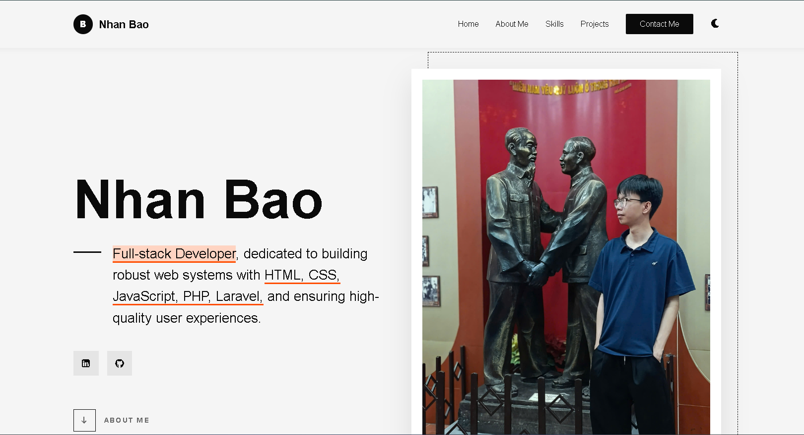

# 🌟 Personal Portfolio - Bao Nguyen Nhan

<p align="center">
  
</p>

<p align="center">
  <strong>Modern, interactive, and responsive personal portfolio showcasing skills, academic projects, and web development experience.</strong>
</p>

<p align="center">
  <a href="https://nhanbaoit.github.io/Personal-Portfolio-NguyenNhanBao/"></a>
  <a href="https://github.com/nhanbaoit/Personal-Portfolio-NguyenNhanBao"></a>
  <a href="public/files/NguyenNhanBao_Fullstack-Intern_Resume.pdf"></a>
</p>

<p align="center">
  
  
  
  
  
  
  
  
  
</p>

---

## 📌 Table of Contents

- [Overview](#-overview)
- [Key Features](#-key-features)
- [Tech Stack](#-tech-stack)
- [Project Structure](#-project-structure)
- [Academic Projects Showcased](#-academic-projects-showcased)
- [Getting Started / Local Setup](#-getting-started--local-setup)
- [Contact Information](#-contact-information)
- [License](#-license)

---

## 📖 Overview

This repository contains the source code for the personal portfolio of **Bao Nguyen Nhan**, an Information Technology student at **Thu Duc College of Technology** aiming to become a **Full-stack Developer**.

The portfolio is designed with a **Neobrutalism-inspired** modern aesthetic, featuring bold typography, strong contrast borders, clean cards, and micro-interactions. It serves as a central hub to present:
- Technical skills and stack proficiencies
- Hands-on academic and full-stack projects
- Resume download
- Contact and messaging channel

🔗 **Live Website**: [https://nhanbaoit.github.io/Personal-Portfolio-NguyenNhanBao/](https://nhanbaoit.github.io/Personal-Portfolio-NguyenNhanBao/)

---

## ✨ Key Features

- **🌓 Dark Mode / Light Mode**: 
  - One-click toggle between sleek light and dark themes.
  - Automatically remembers user preference across visits via `localStorage`.

- **🎨 Neobrutalism Design & Smooth Micro-Interactions**:
  - Distinctive bordered cards, accent colors, and custom shadow offsets.
  - Interactive **3D tilt effect** on profile photo based on mouse movement.
  - Tech badge entrance animations and interactive hover transitions.

- **📱 Fully Responsive Layout**:
  - Flawless user experience across Desktop, Tablet, and Mobile screens.
  - Mobile-optimized navigation and flexible grids.

- **⚡ Performance & Smooth UX**:
  - Custom **Page Loader** with logo branding.
  - **Scroll Reveal** and **Lazy Loading** for images using native `IntersectionObserver`.
  - Dynamic navbar shadow and active menu highlighting on scroll.
  - Reading scroll progress indicator support.

- **📬 Functional Contact Form**:
  - Integrated with **Formspree** (`POST` endpoint).
  - Client-side validation (required fields, valid email format).
  - Custom floating **Toast Notification** system for real-time success and error feedback.

- **📄 Resume Integration**:
  - Direct download link for `NguyenNhanBao_Fullstack-Intern_Resume.pdf`.

---

## 🛠 Tech Stack

### Core Technologies
| Area | Technologies |
| :--- | :--- |
| **Frontend** | HTML5, CSS3, JavaScript (ES6+), Tailwind CSS (CDN) |
| **Fonts & Icons** | Google Fonts (*Inter*, *Space Grotesk*), Font Awesome v6 |
| **Animation & Effects** | Vanilla JS `IntersectionObserver`, 3D Card Tilt, CSS Animations |
| **Form Backend** | Formspree API |
| **Hosting & Deployment** | GitHub Pages |

### Personal Technical Competencies Highlighted
- **Frontend**: HTML5, CSS3, JavaScript, React, Bootstrap, Tailwind CSS, Responsive Web Design.
- **Backend & Database**: PHP, Laravel, MySQL, SQL, RESTful CRUD, Authentication, E-commerce Business Logic.
- **Tools & QA**: Git, GitHub, Postman, Docker, Manual Testing, Java, C#.

---

## 📂 Project Structure

```text
Personal-Portfolio-NguyenNhanBao/
├── index.html                   # Main single-page HTML layout
├── README.md                    # Project documentation
├── LICENSE                      # MIT License
└── public/
    ├── css/
    │   ├── style.css            # Base stylesheet
    │   └── styles.css           # Core styling & Neobrutalism design rules
    ├── js/
    │   ├── main.js              # Interactivity (Dark mode, Scroll reveal, 3D tilt, Form)
    │   └── scrollreveal.min.js  # ScrollReveal library
    ├── files/
    │   └── NguyenNhanBao_Fullstack-Intern_Resume.pdf  # Curriculum Vitae
    └── img/                     # Images, project screenshots, and favicon
        ├── Portfolio.png
        ├── project-btris.png
        ├── Techstore.png
        ├── about-me.jpg
        └── favicon.svg
```

---

## 🚀 Projects Showcased

### 1. Personal Portfolio Website
- **Role**: Frontend Developer
- **Tech Stack**: React 18, Three.js, Vite, Tailwind CSS, JavaScript (ES6+)
- **Key Features**: Responsive design, Dark Mode toggle, Interactive Three.js 3D scene (rotatable & interactive), 3D tilt interaction, Scroll animations, Formspree contact form.
- **Live Demo**: [nhanbaoit.github.io/Personal-Portfolio-NguyenNhanBao](https://nhanbaoit.github.io/Personal-Portfolio-NguyenNhanBao/)

---

## 💻 Getting Started / Local Setup

To preview and run this portfolio locally on your machine:

### 1. Clone the repository
```bash
git clone https://github.com/nhanbaoit/Personal-Portfolio-NguyenNhanBao.git
cd Personal-Portfolio-NguyenNhanBao
```

### 2. Install dependencies
```bash
npm install
```

### 3. Run development server
```bash
npm run dev
```
Open `http://localhost:5173` in your web browser.

### 4. Build for production
```bash
npm run build
```

---

## 📬 Contact Information

- **Full Name**: Bao Nguyen Nhan (Nguyễn Nhân Bảo)
- **Major**: Information Technology – Thu Duc College of Technology (Expected 2027)
- **Email**: [nhanbao.0410@gmail.com](mailto:nhanbao.0410@gmail.com)
- **GitHub**: [github.com/nhanbaoit](https://github.com/nhanbaoit)
- **LinkedIn**: [linkedin.com/in/bao-nguyen-nhan-b64251381](https://www.linkedin.com/in/bao-nguyen-nhan-b64251381/)

---

## 📄 License

This project is licensed under the [MIT License](LICENSE). Feel free to use this template as inspiration for your own portfolio.